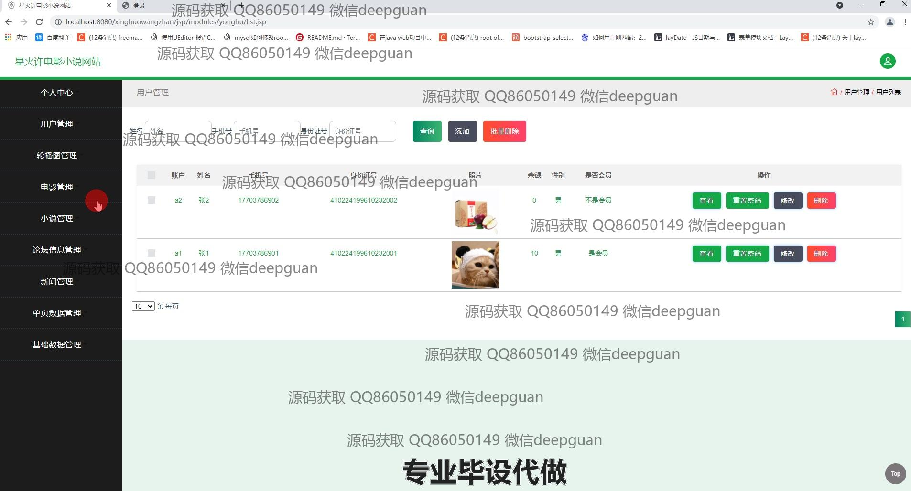
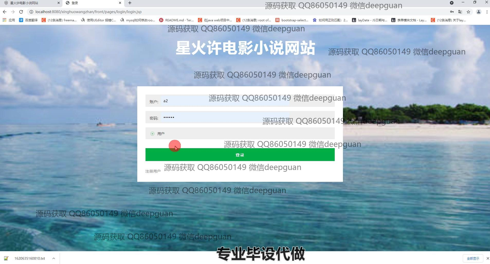
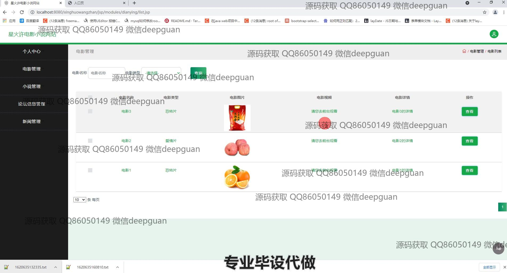

<h1 align="center">星火许电影小说网站设计</h1>

## 简介
星火许电影小说网站设计：提供用户管理、电影管理、小说管理、论坛信息管理、后台数据管理等多种功能模块，支持用户注册登录、信息编辑、内容发布与管理，界面简洁易用，方便高效操作。    --计算机毕业设计源码；毕设源码；java毕业设计源码

## 联系方式

<h3 align="center">获取完整代码与数据库文件 + 微信：deepguan QQ: 86050149 QQ群: 783742310</h3>

<h3 align="center">可帮忙远程部署 包运行成功！提供远程部署、修改代码、设计文档指导、代码讲解等服务！</h3>

## 功能介绍（完整见运行截图）
管理员：  
基本功能：登录、注册、退出，用户管理，电影管理，小说管理，论坛信息管理，新闻管理，轮播图管理，分类管理，单页数据管理，基础数据管理。  
网站首页：导航栏功能，包括首页、网站介绍、公司介绍、电影、小说、论坛交流等，支持电影、小说的编辑、删除、查看、筛选与批量操作。  
个人中心：查看并修改管理员个人信息，包括账号、姓名、手机号等；支持用户权限管理与内容更新。  

用户：  
基本功能：登录、注册、退出，查看和修改个人信息，如姓名、手机号、身份证号、性别、会员状态等，上传头像，查看余额。  
网站首页：访问导航栏功能，包括首页、电影、小说、论坛交流、新闻等；支持电影收藏、小说收藏功能以及用户间论坛互动。  
个人中心：查看和管理个人收藏的电影和小说，支持评论功能并查看个人会员状态，方便快速管理个人资料和偏好设置。

## 运行截图

本代码来源于网络,仅供学习参考使用!

